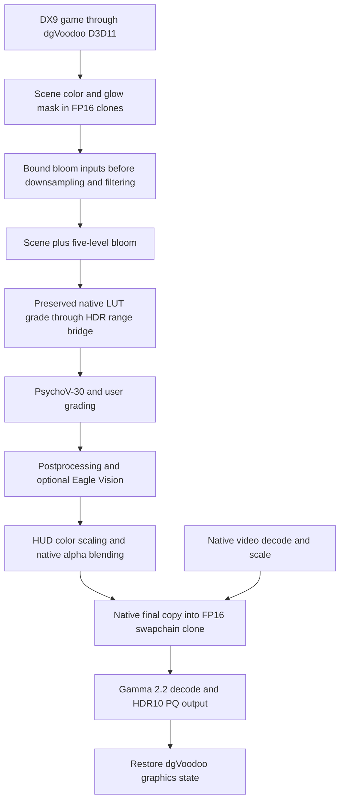

# Assassin's Creed II: implementation and porting guide

Implementation completed in the September 2026 session for **Hartapfel**.
This document describes the final implementation, the failures that led to it,
and the handoff for Assassin's Creed Brotherhood and Revelations.
[README.md](README.md) covers usage/building; [PIPELINE.md](PIPELINE.md) preserves
the chronological capture evidence, including superseded experiments.

## Final architecture

AC II is a **32-bit DX9 game without native HDR**. dgVoodoo translates its
rendering to **D3D11**, where 32-bit ReShade and the RenoDX addon operate.
The old native-DX9 `asscreed2` implementation was replaced entirely. Its DX9
shader hashes are not the identifiers used by this implementation.



The internal color/composition representation remains encoded BT.709-shaped
floating point. Gamma 2.2 is the final user-selected decoding convention for
scene/LUT, HUD, Eagle Vision and proxy input. Signed BT.709 channels can represent
valid colors in the selected BT.2020 target; they are not automatically errors.
The public swapchain is RGB10A2 with HDR10/ST2084 color space. Output is fixed to
HDR10 and the removed Output Mode/Input Encoding settings cannot override it.

The final proxy uses `renodx::draw::SwapChainPass` for output conversion. Real
upstream range is preserved before the native SDR limits; this is not an
inverse-tonemap applied to the finished SDR scene and HUD.

## Source map

| File / shader | Responsibility |
|---|---|
| [addon.cpp](addon.cpp) | Resource-clone rules, replacement selection, actual DX11 blend-state inspection, presentation-state restoration, controls, HDR10 color space and automatic peak detection |
| [shared.h](shared.h) | 112-byte injection layout, version marker 30, fixed gamma 2.2/HDR10 shader configuration |
| [common.hlsli](common.hlsli) | Native-LUT range bridge, calibrated anchors, PsychoV input/output grading, working-range shoulder and Color Filter |
| [psychov30.hlsli](psychov30.hlsli) | Ghost of Tsushima's local `test30.hlsl` implementation with the AC2 shadow-scalar correction |
| [0x61888319.ps_5_0.hlsl](0x61888319.ps_5_0.hlsl) | Scene/LUT replacement; marks the end of pre-LUT bloom work |
| [0x8FA72580.ps_5_0.hlsl](0x8FA72580.ps_5_0.hlsl), [bloom.hlsli](bloom.hlsli) | Shoulder on each of 16 input samples before bloom downsampling |
| [0x5574B6B8.ps_5_0.hlsl](0x5574B6B8.ps_5_0.hlsl), [eagle_vision.hlsli](eagle_vision.hlsli) | Eagle Vision composition without the final SDR ceiling |
| [0x0DA2DE91.ps_5_0.hlsl](0x0DA2DE91.ps_5_0.hlsl), [0x12BA0F50.ps_5_0.hlsl](0x12BA0F50.ps_5_0.hlsl), [0x2EAA46EB.ps_5_0.hlsl](0x2EAA46EB.ps_5_0.hlsl), [ui.hlsli](ui.hlsli) | HUD color scaling with preserved alpha, premultiplication and mask behavior |
| [swap_chain_proxy_pixel_shader.ps_5_x.hlsl](swap_chain_proxy_pixel_shader.ps_5_x.hlsl), [swap_chain_proxy_vertex_shader.vs_5_x.hlsl](swap_chain_proxy_vertex_shader.vs_5_x.hlsl) | Addon-owned presentation shaders; only DX11 variants are registered |
| [resource_replace.hpp](../../utils/resource_replace.hpp) | Shared DevKit upload-observation cache limits and allocation-failure handling |
| [platform.hpp](../../utils/platform.hpp) | Shared process-heap allocation with correct alignment for over-aligned types |

There are **six game pixel-shader replacements**, discovered through
`__ALL_CUSTOM_SHADERS`. Shader/pipeline cloning is forced. Injection uses `b13`
and expected space 50 (the SM5.0 sources use `b13` without register spaces).
The original shader constant buffers remain separate. Legacy output/decoding
slots stay in the injection structure to preserve its layout.

Reference implementations: [Ghost's PsychoV-30 source](../gotsushima/test30.hlsl),
[Ghost's controls and peak callback](../gotsushima/addon.cpp), and
[Resonance's peak detection](../resonanceplaguetalelegacy/addon.cpp).

## 1. Preserve and validate the native shaders first

The initial dump contained **354 DXBC shaders**. Original bytecode, disassembly,
raw decompilation/reference HLSL, separate working copies, a backup ZIP and SHA-256
manifests were retained in the game-local directory:

```text
E:\SteamLibrary\steamapps\common\Assassin's Creed 2\renodx-dev\shader-baseline-20260913
```

The original dump remains under `renodx-dev/dump`; local analysis copies are under
`tmp/asscreed2/shader-audit/delivery/`. Protected references are not the editable
mod sources. Keep dumped `.cso` files out of the live/source mod directory: they
can shadow the HLSL intended for replacement.

All 354 reference HLSL shaders recompiled, but only 121 passed warnings-as-errors.
More significantly, 183 pixel shaders required review of dgVoodoo channel-mask
decompilation. **Compiling a decompiled shader is not proof of equivalence.**
Numeric casts around sampled float/uint AND/OR operations must be repaired with
bit reinterpretation (`asuint`/`asfloat`) where the assembly requires it. Preserve
sample addressing, component masks, alpha, discard and blend behavior.

The video decoder `0x471059BE.ps_5_0` also exposed an `ubfe` decompiler hazard:
reusing a register component after overwriting it can unpack subsequent channels
from the wrong value. No replacement was necessary for this decoder; its native
bytecode was retained. These are DXBC SM4/5 shaders, not DXIL/SM6 decompilation work.

## 2. Resource upgrades: cloning, timing and integer views

The initial capture contained 3,944 draws, 142 shaders and 411 resources. Its
final FP16 swapchain clone was active, but earlier scene/bloom/postprocess/HUD
targets were still RGBA8 UNORM and had already clipped the signal to `[0,1]`.
The 16³ LUT application was identified before the HUD. No LUT-builder shader or
standalone native filmic tonemapper was established.

The first direct FP16 replacement failed for two independent reasons:

| Problem | Correction |
|---|---|
| dgVoodoo also creates `r8g8b8a8_uint` views, incompatible with a resource directly changed to FP16 | Keep original resources/integer views and use FP16 resource/view clones for color rendering |
| The main scene target is created before the final swapchain size is available | Install static rules at addon attachment, ready for device/resource creation, rather than deriving them only during final swapchain initialization |

The final rule matches `r8g8b8a8_typeless`, requires render-target usage, excludes
depth/stencil and UAV usage, and creates `r16g16b16a16_float` clones. Its 16:9
aspect ratio with tolerance 0.1 includes rounded bloom sizes such as 60×33 and
30×16. Ordinary sample-only textures, depth and the 16³ LUT remain unchanged.
This is a captured color-target family, not a blanket upgrade of all RGBA8 data.

The corrected runtime contained active FP16 scene/bloom/postprocess/HUD targets.
A separate upstream scene input reached encoded RGB `(2.467, 2.123, 1.651)` with
92,158 above-one pixels and no NaN/Inf. This established usable HDR headroom before
the LUT. The native LUT still limited the final image, motivating the next step.

For another game, recheck creation order, typeless aliases, copy endpoints,
integer-view consumers, resource recreation, resolution and aspect-ratio coverage.
Do not carry over resource handles, draw numbers or these dimension assumptions.

## 3. Native LUT grading and PsychoV-30

`0x61888319` reads scene color at `t0` and a 16³ native grade at `t33/s1`.
Coordinates retain the game's `cb4[8].xyz` scale and `cb4[9].xyz` offset.
Its output alpha stays zero. The HDR path in `AC2GradeHDR`:

1. Decodes the scene into linear BT.709.
2. Fits signed/out-of-gamut color with Adaptive D65 gamut compression.
3. Uses max-channel N2 compression to enter a bounded LUT input range.
4. Encodes that input, samples the native grade, and decodes the result.
5. Restores the range scale and reverses the gamut fit before tone mapping.

Hardware trilinear interpolation weights caused quantization to become visible
when the bridge restored a large HDR scale. The correction is explicit eight-tap
`Texture3D.Load` trilinear interpolation with shader-precision weights. Native
coordinates and sample bit masks remain intact. Vanilla/invalid injection keeps
the original hardware-sampled LUT path.

PsychoV-30 was taken from Ghost of Tsushima's local `test30.hlsl`, not an older
shared implementation. AC2 calibrates input/output gray anchors through its own
native LUT, using unit pre-LUT logarithmic slope. Ghost's game-specific SDR curve,
matrices and square-root shaper were not copied. Anchor controls scale these
measured gray levels; the artistic LUT derivative is not used as a cone exponent.
The output anchor stays below 95% of display peak, including low-peak/high-white
settings. User contrast is applied as a scalar input-luminance grade; also feeding
it into PsychoV's purity-dividing cone contrast amplified quantization at low values.

Automatic compression uses at least a 4000-nit working range, followed by a
finite-range shoulder to the actual display peak. This preserves highlight
gradients before target-volume projection. Manual compression uses the selected
display peak directly. Uniform linear RGB scaling preserves chromaticity;
negative BT.709 components of valid BT.2020 colors remain meaningful.
Color Filter removes native grade chroma while retaining graded luminance.

## 4. HUD brightness: inspect the actual DX11 blend state

The first HUD slider did nothing because the copied pipeline-subobject guard
did not describe dgVoodoo's separate DX11 blend-state bindings. The correction
uses `ID3D11DeviceContext::OMGetBlendState` in `IsUIColorDraw`, releases the COM
reference, and selects the three HUD replacements by actual draw state.

Alpha-only/no-color writes and destination/source-color multiplicative blends
retain native behavior. Supported color draws scale decoded color by
`UIWhite / GameWhite`, then re-encode it. `ONE` / `INV_SRC_ALPHA` premultiplication
is handled by unpremultiplying before color conversion and repremultiplying afterward;
zero-alpha input is preserved. Native alpha and discard behavior stay intact.

The final proxy scales by **game white**, not UI white. This is essential: moving
UI scaling to the presentation pass would also rescale the scene. The user verified
80/500-nit HUD settings with an unchanged scene, then restored 203 nits.

### Sun/flare reuse of a HUD shader

A later sun-facing gameplay capture revealed that `0x0DA2DE91` also draws the
sun and lens flare. Shader hash and RGB-write checks alone let UI Brightness
scale their energy before the scene tonemapper. The 1,449-draw capture contained
four color-writing additive invocations (932, 935, 1265, 1389) before the LUT at
1418. Readbacks identified the 128×128 sun sprite and 64×64 soft flare sprite;
the same shader subsequently sampled HUD atlases with ordinary alpha blending.
The vertex shader was shared too, so selecting by that hash would not separate them.

`IsUIColorDraw` now rejects **pre-LUT `ADD` / `ONE` / `ONE` color blends**, using
the existing per-frame `scene_tonemapped` marker. Their original scene contribution
then passes through the normal LUT/PsychoV path without a UI multiplier. Additive
HUD draws after the LUT remain eligible. Ordinary alpha-blended/opaque menu draws
remain eligible even when no scene LUT runs. Existing mask/multiply and
premultiplication handling is unchanged; no texture-size or resource-handle
whitelist is used.

An x86 WARP fixture ran the actual callback against 33 captured blend states and
nine additional regression cases. All 42 passed; the preceding callback failed
exactly the four sun/flare cases. Runtime verification should sweep UI Brightness
at 80/500 and restore 203 with the sun visible, then check HUD and menus. Recheck
the pass order and blend mode in Brotherhood/Revelations: shared sprite shaders
are not necessarily UI, and additive menu art without a LUT needs separate review.

The x86 Release addon rebuilt successfully and matched the installed linked
artifact. After restarting, the user confirmed the requested sun/HUD brightness
sweep and pause-menu check worked correctly: UI scaling no longer affects the
sun/flare. The native sun contribution remains in the scene tonemapping path.

## 5. Bloom: fix the common input before blur spreads excessive energy

### Symptom and diagnosis

After FP16 upgrades, glowing street objects produced broad white discs pinned
near display peak. Readbacks showed a separate scene maximum around 2.416,
a bloom-combination maximum around 327, and an upstream glow mask reaching 799.
These are encoded/mask-domain values, not nits. Original UNORM writes had hidden
the excessive gains; simply removing those limits exposed them to every blur level.

The common path was mask copy → `0x8FA72580` downsample → multiplication with
downsampled scene via `0x6B413C5D` destination-color blending → five filtered levels
→ `0x7405432A` sum → `0x35D82084` addition to the separate scene.

### Final correction

Apply `AC2BloomSeed` to **each of the 16 source samples before averaging**. For
`m = max(R,G,B)`, preserve the sample exactly when `m <= 1`; otherwise use:

```text
f(m) = 2 - 1/m
corrected_RGB = RGB * f(m)/m
```

The shoulder is continuous with unit slope at 1, keeps values above 1 unlocked,
preserves RGB ratios and leaves alpha unchanged. The resources remain FP16.
Extreme energy is controlled before it spreads spatially; the separate scene
signal remains untouched. This solves many glowing objects through one common
preparation pass instead of replacing each object's material shader.

**Invocation selection is as important as the curve.** `0x8FA72580` is reused
after the LUT for postprocessing. `scene_tonemapped` resets at the upgraded
swapchain's Present, and `0x61888319.on_draw` marks it true. The bloom replacement
is allowed only before that marker, in PsychoV mode on D3D11. Later depth-of-field
and Eagle Vision filtering must not receive the bloom-input shoulder.

A final-combination live experiment was inconclusive: DevKit reported a file
replacement but the active FP16 clone did not show the expected bounded result.
It was not accepted as proof. The embedded pre-downsample addon correction was
built, restarted and verified. A 799-valued impulse among 16 samples contributes
0.124922 with the correction versus 49.9375 without it. The user confirmed that
the white discs disappeared; above-white final values remained with no NaN/Inf.

For Brotherhood/Revelations, identify the common mask/filter input and prove its
position relative to the scene grade. Reusing an AC2 shader hash or applying the
curve indiscriminately to a shared blur shader can damage postprocessing.

## 6. Eagle Vision: remove the composition ceiling without amplifying the effect

In the Eagle Vision capture, `0x5574B6B8` followed the scene LUT/PsychoV pass.
It remaps two signed effect textures with `2*x-1`, applies native weights, adds
them to the scene and uses `add_sat` on RGB. Its effect/filter targets already
had FP16 clones; the final explicit saturation was the remaining ceiling.

The replacement repairs six decompiler bit casts and changes only that color
composition. Native effect weights, black floor and alpha 1 remain. Distance,
opacity and radial-blur coordinate clamps are not HDR ceilings and are retained.

The encoded sum is decoded to linear light. If it exceeds the existing scene
peak or reference knee, added energy rolls toward the available display headroom:

The scene/composite peaks are maximum channels in the selected linear target
gamut; `display_peak = PeakNits / GameWhiteNits` uses the same relative units.

```text
knee = min(1, display_peak/2)
anchor = min(max(scene_peak, knee), display_peak)
headroom = display_peak - anchor
excess = composite_peak - anchor
fitted_peak = anchor + excess * headroom/(headroom + excess)
```

Scale the linear composite uniformly and re-encode it. Unchanged/zero-effect
scene values remain exact; the scene is not tone-mapped twice. Vanilla or invalid
injection uses native saturation. The earlier development build also had an SDR
bypass; the final fixed-HDR10 configuration removed that output-mode branch.
User verification confirmed the highlights, and the final readback retained
138,550 above-one pixels with no NaN/Inf.

## 7. Video playback: three distinct failures and their fixes

### A. Triangular cropping: presentation state leaked into video drawing

The video capture contained three native draws:

| Pass | Pixel shader / vertex shader | Resource path |
|---|---|---|
| Packed BGRA decode | `0x471059BE.ps_5_0` / `0xC7CE95B3.vs_4_0` | Uploaded 1280×720 `r32_typeless` with uint view → decoded movie FP16 clone |
| Movie scale/blit | `0x915F8B01.ps_5_0` / `0xA2F269CA.vs_5_0` | 1280×720 movie → 3840×2160 main-color FP16 clone |
| Final copy | `0x880A17D3.ps_4_0` / `0xC4FF799B.vs_4_0` | Main color → swapchain FP16 clone |

Both sizes are 16:9. The actual defect was missing triangles: approximately half
the main target and one quarter of the swapchain clone were covered. A UV/aspect
correction would not address that evidence.

Set `renodx::mods::swapchain::swapchain_proxy_revert_state = true` before device
creation. The output proxy binds its fullscreen triangle pipeline, topology,
viewport and other state. Restoring the tracked preceding state is necessary
because dgVoodoo reuses state across video frames. Triangle-list leakage into
quad draws explains the observed geometry, although the capture API did not expose
native input-assembler topology to measure that individual state directly.

With restoration enabled, both 4K color targets had full alpha coverage and the
triangular cutouts disappeared. The user confirmed normal playback framing.
**No native video shaders, sampling coordinates or resource dimensions were
changed.** All six video shaders were already in the protected baseline.

### B. Crash during playback: DevKit retained every unique video frame

Correct framing exposed a separate crash that also occurred before the crop fix.
An attached debugger caught `std::bad_alloc` in DevKit's
`resource::replace::RecordObservation`, called from `OnUpdateTextureRegion`.
Every unique 1280×720 frame retained another **3,686,400-byte CPU sample** without
a total budget. This exhausted the 32-bit process's memory; it was not a new
video tonemapping or resource-format failure.

The shared fix in `resource_replace.hpp`:

- Limits retained sample bytes to **64 MiB per device**, rather than per frame.
- Limits observation metadata to **4,096 records**. Existing matches still update
  counters; new observations beyond the cap are not appended.
- Keeps metadata without sample bytes once the sample budget is full.
- Catches capture-allocation failure so optional observation does not abort the
  application's texture upload. Texture replacement behavior remains separate.
- Allows clearing observations to recover capture capacity.

The x86 fixture processed 512 full video frames and retained only 18 large samples
(66,355,200 bytes). It tested the record cap, duplicate counters, partial-upload
bypass, allocation failure and recovery. The live run reached exactly 64 MiB of
samples as additional smaller uploads filled the remainder. Later private memory
was roughly 0.9 GB instead of growing for every frame, and playback completed.
Rebuild **DevKit** with this fix; rebuilding only the game addon does not correct
an older DevKit's observation callback.

### C. Intermittent launch crash: over-aligned shared data on the process heap

Earlier and subsequent launches also failed before DevKit loaded. The saved dump
identified `shader::SharedData` construction in the game addon: `movaps` wrote to
an address ending in `0x08`. The actual type is 6,208 bytes and requires 64-byte
alignment, while the process heap guarantees only 8 on x86 and 16 on x64.

`platform.hpp` now honors `alignof(T)` in both `ProcessAllocator` and the shared
object factory. Types exceeding heap alignment get padded storage plus a retained
base pointer for the matching process-heap free. Normally aligned allocations
keep their previous layout. Overflow is checked, and a throwing constructor frees
its allocated storage. Shared-object and allocator APIs retain their signatures.

x86/x64 tests covered 8/16/64/256-byte alignment, zero/multiple counts, overflow,
zero initialization, constructor exceptions and heap validation. Both repeatedly
constructed/freed the exact shader-data type. Rebuild compatible participating
addons together; do not mix old allocation/free implementations for shared data.
The user confirmed successful video completion after both crash fixes.

## 8. Shadows, controls, output and automatic peak

The final controls are Ghost's non-effect PsychoV/color-grading set. No effect
sliders were added. Flare is its tonemapping compensation control. The footer
copies Reset All, RenoDX Discord, HDR Den Discord, GitHub, Hartapfel/ShortFuse
Ko-Fi links, credits and build timestamp. Instructions require Windows HDR and
dgVoodoo DX11, not nonexistent native game HDR. Copyright follows the
Carlos Lopez/Hartapfel header; the metadata maintainer is `hartapfel`.

The original PsychoV shadow scalar could become negative at low settings. Later
`CopySign` restored the original cone signs to its magnitude, reflecting the
negative brightness into light and causing the washed-out result. At the high
endpoint, `pow(ratio, 0)` introduced a nonzero black offset.

The AC2-local correction grades log-distance below the adaptation anchor:

```text
s = UI_Shadow_Value * 0.02       # UI 0..100; neutral 50 -> s=1
d = log2(anchor) - log2(x)       # only for 0 < x < anchor
p = 2^(1 - clamp(s, 0, 2))
d_graded = d * (1 + (p-1) * d/(d+4))
y = anchor * 2^(-d_graded)
```

Black, neutral and values at/above the anchor bypass the transform. The curve
is positive, monotone in input and slider position, and has unit slope at the
anchor. Only this scalar differs from the imported PsychoV source; Ghost itself
was not edited. 606 WARP control/anchor cases × 256 inputs passed. The final
gamma-2.2 LUT/HUD fixture also passed: relative LUT error 0.000511169, UI error
0.00000117448, and no scene change from UI settings.

Peak detection copies Ghost's `OnInitSwapchain` logic, also present in Resonance:
query `utils::swapchain::GetPeakNits`, find `ToneMapPeakNits` by key, set its reset
default to the detected peak clamped to 400–4000, and enable resetting. Change
and persist the current value only if it equaled the previous default. Stop after
the first successful query; a failed query leaves the 1000-nit fallback and can
retry on a later swapchain initialization. This is initialization-time detection,
not continuous monitor tracking. A manual value numerically equal to the old
default is indistinguishable from that default, as in the reference mods.

Peak Reset/Reset All use the detected default. `OnPresetOff` retains its explicit
1000-nit assignment while selecting Vanilla; it does not restore SDR transport.
FP16 resources and gamma-2.2/HDR10 output remain, so Preset Off is not a claim of
pixel-exact unmodified SDR. The automatic-peak Release build compiled and matched
the installed addon; a measured per-monitor runtime peak was not recorded.

## 9. Capture and build practices that mattered

- Use compatible **32-bit Release** game addon and DevKit builds. Build the smallest
  targets with `clang-x86-release`; keep the game closed when replacing loaded DLLs.
- Native baseline decompilation and shader-only equivalence come before HDR edits.
  Preserve original references and make editable copies for every new target.
- Queue a snapshot, then verify current resource/view handles, clone handles,
  dimensions and formats. Resource readbacks are live, not frozen historical draw
  attachments. Alt-tab/recreation produced misleading stale-view reads that were
  rejected. Animated before/after frames are not pixel-exact comparisons.
- Do not interpret encoded maxima or alpha as nits. Check RGB, NaN/Inf and the
  selected color representation before deciding a signal is clipped or over peak.
- DevKit reporting a File replacement was insufficient proof in a clone-path
  experiment. Confirm the actual clone result. Unloading live shaders also removed
  active game replacements during that experiment; restore/restart before judging
  appearance. The verified solution ships as embedded Add-on replacements.
- Short startup videos need an already-armed capture watcher. The local bridge
  auto-discovers the DevKit pipe so a restarted game's PID does not invalidate the
  capture command. An unfocused/nonpresenting game can leave a snapshot queued.
- Debug a playback crash separately from a geometry defect. Correlate process ID,
  timestamps, exception type and module; an older launch dump may describe a
  different failure. Save binary/symbol pairs before rebuilding.

```powershell
# x86 Visual Studio environment with Clang available; game closed
cmake --build --preset clang-x86-release --target asscreed2
# Also rebuild DevKit when shared capture/allocation code changes:
cmake --build --preset clang-x86-release --target devkit
```

Game binary directory: `E:\SteamLibrary\steamapps\common\Assassin's Creed 2`.
ReShade is `dxgi.dll`; dgVoodoo remains `D3D9.dll`.
The game addon is linked to `build32/Release/renodx-asscreed2.addon32`.
DevKit is an installed **copy** of `build32/Release/renodx-devkit.addon32` after
Windows rejected recreating its former `build32.vs/Release` symlink without
administrator privileges. Copy future DevKit builds explicitly. These are local
deployment facts, not assumptions for another machine or game.

## 10. Brotherhood and Revelations handoff

Similar engine behavior is a useful hypothesis, not proof that AC2 hashes or
invocation order will match. Work on each game independently through this sequence:

| Stage | Reuse from AC2 | Evidence required in the next game |
|---|---|---|
| Bootstrap | 32-bit dgVoodoo DX11 architecture and HDR10 proxy pattern | Actual API/architecture, loader placement and swapchain creation order |
| Native reference | Backup/decompile/assembly-audit process | Complete per-game dump; native semantic equivalence for selected replacements |
| HDR resources | Clone original typed/integer-compatible resources | Connected scene/copy/bloom/postprocess/HUD targets; original uint views; new resolution/aspect rules |
| Scene transform | HDR LUT bridge and PsychoV-30 integration | Scene-grade shader, LUT dimensions/encoding, coordinate/mask math and game-specific gray anchors |
| HUD | Actual DX11 blend-state classification and game/UI white separation | HUD shaders, alpha modes, masks, multiplicative draws, menus and subtitles |
| Shared sun/HUD sprites | Exclude pre-LUT additive scene draws from UI scaling | Sun/flare draw order and blend mode; preserve post-LUT additive HUD and menu behavior |
| Bloom | Smooth input shoulder before spatial filtering | Common glow/mask input, all contributing levels, separation from later uses of the same filter shader |
| Eagle Vision | Signed-effect composition with a headroom shoulder | Effect decoding/weights, final color saturation and position after scene tonemapping |
| Video geometry | Restore presentation-proxy state | Decoder/blit/copy chain and full target coverage; inspect geometry before changing UVs |
| Video stability | Shared bounded observation cache and aligned allocation | Updated compatible DevKit/addon builds, stable memory through a full video, correct startup |
| Controls | Fixed output, corrected Shadows and peak detection | Per-game encoding choice, valid display peak, reset/manual-setting behavior |

Regression scenes should include ordinary daylight and dark interiors, glowing
street objects/fire, Eagle Vision, HUD/minimap and menus, startup and in-game
movies, subtitles/fades, loading transitions, and supported resolutions/aspects.
Check black/midgray/highlights, absence of giant bloom discs, independent HUD
brightness, full video coverage, stable memory and restarts. Recheck any reused
filter shader on both sides of the scene-grade pass before adding a guard.

The explicit user visual confirmations in AC2 covered HUD separation, the bloom
fix, Eagle Vision, video geometry, and full playback after the crash corrections.
Shadows/fixed-encoding and automatic peak have the build/test evidence described
above; dedicated final slider/monitor measurements were not recorded. Other
aspect ratios, unobserved shader variants and all recreation cases are not claimed
exhaustively validated. The user accepted the implementation as complete.

## Evidence index

These are local session artifacts, not prerequisites for building the source.
Archive them separately if future ports need the raw captures; `tmp/` may be
cleaned or untracked. The implementation and reasoning above remain usable without
the scratch files.

| Local workspace directory under `tmp/asscreed2/` | Contents |
|---|---|
| `shader-audit/` | Protected-reference delivery copy, decompile/compilation audit |
| `live-20260914/` | Initial 3,944-draw trace, 142-shader inventory, resource chain and tool catalog |
| `implementation-20260914/` | Direct-upgrade trial, corrected clone chain, upstream headroom and scaffold backups |
| `psychov30-20260914/` | Tonemap/LUT/HUD fixtures, resource captures and build audits |
| `bloom-20260914/` | Mask/bloom readbacks, failed experiment notes, impulse test and verified scene |
| `eagle-20260914/` | Signed effect chain, native/fixed composition, WARP tests and user-confirmed readbacks |
| `video-20260914/` | Original/fixed three-draw videos, debugger logs, symbol maps, memory trace, cache/alignment tests, source/addon backups |
| `final-controls-20260914/` | Shadow sweep, gamma-2.2 LUT/HUD tests, footer/source audit and preceding build |
| `auto-peak-20260914/` | Exact Ghost callback comparison, Release build and installed-artifact hash |
| `sun-ui-20260914/` | Sun-facing capture, sprite readbacks, source/addon backup and real-DX11 callback regression test |

For video comparisons, `capture-1789390024870183700` is the cropped reference and
`capture-1789390316745211600` is the full-coverage result. `playback-debug-retry.txt`
records the playback exception stack; its attempted dump export failed, so use
the saved stack/symbol-map evidence rather than assuming a playback `.dmp` exists.
The earlier startup dumps were available through Windows CrashDumps and resolved
separately. `audit.json` files tie the successive builds to their validation;
historical hashes are not the final addon hash.
