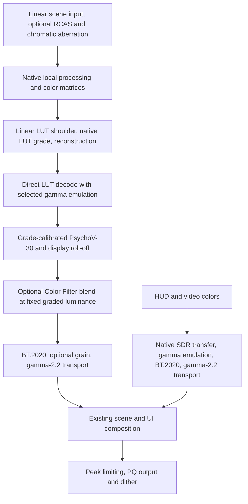

# Ghost of Tsushima DIRECTOR'S CUT — RenoDX

A native HDR mod for the PC version of **Ghost of Tsushima DIRECTOR'S CUT**, using Direct3D 12. It replaces the game's HDR tone curves with **PsychoV-30**, retains the game's LUT-based artistic grading, and gives scene and UI brightness separate controls.

The mod also corrects HUD and video colors for BT.2020 output, applies the selected SDR gamma emulation to both scene and UI, and offers optional perceptual film grain, Lilium RCAS sharpening, and UE5-style chromatic aberration. These changes are implemented in the game's shaders, before the completed frame is presented.

**Native HDR must be enabled in the game.** The addon is `renodx-gotsushima.addon64`.

## Getting started

1. Use an x64 ReShade installation with addon support configured for the game's D3D12 executable, `GhostOfTsushima.exe`.
2. With the game closed, place `renodx-gotsushima.addon64` in ReShade's configured addon directory. In the development installation this is `reshade-shaders/Addons/`.
3. If upgrading from the former `ghostoftsushima` mod, remove `renodx-ghostoftsushima.addon64` from that directory. Load only one copy of this game addon. The displayed addon name and saved RenoDX setting keys are unchanged.
4. Enable native HDR, open the RenoDX panel, and select **PsychoV-30**. The red **Recommended** button applies the mod's recommended grading values.
5. Set **Peak Brightness** for your display, then adjust **Game Brightness** and **UI Brightness** to taste.

The UI brightness override replaces the native HUD brightness multiplier on supported color draws. With PsychoV active, use the RenoDX brightness controls. Selecting **Vanilla** restores the original shader paths and native brightness behavior.

## Controls and presets

### Main controls

| Control | Default | Purpose |
|---|---|---|
| Tone Mapper | PsychoV-30 | Chooses Vanilla HDR, PsychoV-30, or the SDR in HDR reference. |
| Peak Brightness | Detected display peak when available; otherwise 1000 nits | Sets the custom output ceiling. Range: 400–4000 nits. |
| Game Brightness | 203 nits | Sets scene reference white. Range: 80–500 nits. |
| UI Brightness | 203 nits | Sets HUD, menu, and supported video reference white independently of the scene. Range: 80–500 nits. |
| SDR Gamma Emulation | 2.2 | Selects None, 2.2, or BT.1886 display-response emulation. HDR output remains PQ in every mode. |
| Perceptual Film Grain | 0 | Adds animated, luminance-dependent scene grain. Range: 0–100; 0 disables it. |
| Lilium RCAS Sharpening | 0 | Sharpens scene detail with noise attenuation. Range: 0–100; 0 disables it. |
| Chromatic Aberration | Off | Enables UE5-style scene color fringing, before HUD composition. |
| CA Intensity | 1.00 | Red/green separation strength, from 0–5. Zero bypasses the effect. |
| CA Start Offset | 0.00 | Unaffected central region, from 0–0.95. Higher values confine fringing to the edges. |

The custom brightness, grading, and effect controls operate with PsychoV selected. **Advanced** settings expose exposure, gamma, highlights, shadows, contrast, saturation, highlight saturation, blowout, flare, hue shift, and PsychoV's response/gamut parameters. The grading **Gamma** control is separate from **SDR Gamma Emulation**.

**Color Filter**, at the bottom of Color Grading, controls the native matrices/LUT grade's color contribution from 0–100 (default 100). At 0, colors come from the scene before those grading stages; scene lighting, fog, and upstream local processing remain. The fully graded result still supplies luminance, so removing the filter does not remove the LUT's brightness or contrast curve. Recommended and Reset All restore 100.

PsychoV defaults to a BT.2020 gamut target, full gamut compression, and automatic compression power. Adaptation and Background Anchor default to 0.1800, which preserves the calibrated baseline. Each slider scales its corresponding input or output anchor by `value / 0.18`; it does not move the LUT calibration samples. Both sliders have four-decimal precision. Cone Response Exponent defaults to 1.0, a multiplier on the contrast calibrated to the native SDR scene curve **before LUT grading and the native display transform**. Hue Shift defaults to 100: 0 retains PsychoV's baseline hue direction, while 100 restores the input hue direction in PsychoV's adaptation-relative cone coordinates. Intermediate values interpolate toward that source without extrapolation. The reference is the LUT-graded input to PsychoV, not the native final HDR frame; with Color Filter below 100, the unfiltered reference receives the same restoration. The control affects scene colors generally, not just flames.

### SDR in HDR reference

Select **SDR in HDR** in Tone Mapper while keeping native HDR enabled. This comparison mode reproduces the game's SDR shader response in a BT.2020/PQ HDR container, with fixed **203-nit white** and **gamma 2.2** for both scene and HUD. It does not extend SDR highlights or expand the SDR gamut.

All mod brightness, gamma-emulation, color-grading, PsychoV, grain, and sharpening controls are disabled and bypassed in this mode. The grading preset and reset buttons are disabled as well. Their saved values are retained; switching back to PsychoV restores their effect. The native artistic LUT grade remains part of the SDR reference.

For a comparison at matching reference white, use default Color Grading and PsychoV30 settings, set PsychoV's Game Brightness and UI Brightness to 203 nits and SDR Gamma Emulation to 2.2, then switch between PsychoV-30 and SDR in HDR on the same scene. PsychoV deliberately omits the native SDR display transform's additional contrast, so its scene shadows and midtones can be brighter even at matching white. The named grading presets further change the calibrated response. The reference always uses gamma 2.2 regardless of the saved gamma dropdown value. It is an SDR display response, applied once before PQ encoding.

The reference restores the SDR scene curve captured from `0x24A0E87E` at RootSrt offsets 344–364. Live SDR/HDR captures confirmed that these coefficients differ between modes while the surrounding color matrices match. It clamps the curve before the second matrix, retains the square-root LUT input and native LUT blends, and bypasses both HDR LUT shoulders and the native HDR scene brightness multiplier. It also restores the SDR scene dither amplitude.

Scene and HUD stay in the SDR composition domain until final output. Ordinary UI draws bypass the native HDR brightness scale without applying the PsychoV UI conversion; multiply overlays retain their native blend behavior. After composition, the output pass reproduces `0x571EE768`'s neutral SDR transfer (sRGB decode followed by the BT.709 OETF), decodes those display codes with gamma 2.2, converts linear BT.709 to BT.2020, and encodes PQ at 203 nits.

The mode uses the captured SDR curve and neutral SDR output calibration. It retains the HDR path's 10-bit intermediate and existing upscaler, rather than recreating every 8-bit resource and rounding step of the native SDR renderer. It is therefore a color/tonal reference, not a promise of identical SDR screenshot bytes. In-game calibration changes, temporal effects, and upscaling can also affect comparisons.

### Preset buttons

Values below are the numbers shown in the UI.

| Setting | Recommended |
|---|---:|
| Cone Response Exponent | 1.15 |
| Highlights | 45 |
| Shadows | 80 |
| Blowout | 5 |

The red **Recommended** button restores the remaining Tone Mapping, Color Grading, and PsychoV30 settings to their current defaults, including Peak Brightness, SDR Gamma Emulation, and Hue Shift. It preserves **Game Brightness**, **UI Brightness**, and both **Effects** sliders. Tone Mapper and Settings Mode also remain selected. Peak Brightness resets to the detected display default when available, otherwise 1000 nits. Recommended is available only with PsychoV selected and is not applied automatically on startup. The former Match native preset has been removed.

**Reset All** resets the settings marked as resettable, including both effects. It retains the selected Tone Mapper and Settings Mode. **Preset Off** explicitly selects Vanilla and disables the custom effects and gamma emulation.

## Rendering pipeline

### Native pipeline

The game's scene postprocessing applies local exposure and spatial effects, color matrices, a component-wise HDR curve, and LUT grading. Its LUT lookup uses square-root-encoded RGB and a max-channel shoulder. The result is scaled into a bounded RGB10A2 intermediate, where HUD/video draws are composited.

The final shader, `0x53EBE0F3`, then applies a scalar rational display curve, a BT.709-to-BT.2020 matrix, an approximate output encoding, and dither. Scene and UI therefore share the native final display transform: the native HUD multiplier does not directly express an absolute brightness in nits.

The native rational response is not a simple, exact gamma-2.4 power function. The PsychoV route bypasses that final curve and approximate encoding, as well as the earlier component-wise HDR curve.

### PsychoV pipeline



The two scene shaders, `0x313ABA52` and `0x43D9A412`, preserve the native upstream processing and both color matrices while bypassing the HDR curve between those matrices. Both retain native LUT addressing and blending; `0x43D9A412` also retains its per-pixel LUT blend mask.

**PsychoV runs after LUT grading.** The curve before the LUT controls lookup coordinates and their reconstruction; it does not replace the post-LUT display tone mapper.

Below Color Filter 100, both scene shader variants also evaluate PsychoV on an identity-grade reference before the native color matrices and LUTs. This reference retains the selected decoding, user grading, and existing calibration. After tone mapping, its chromaticity is normalized to the fully graded output's linear luminance and blended with the graded color. Chroma is reduced toward neutral only as needed to fit the selected gamut and peak, preserving that luminance. This occurs before grain and HUD composition; HUD/video colors and Vanilla/SDR-reference modes are unaffected. Values below 100 cost an additional PsychoV evaluation but no additional LUT samples. At 100 the reference evaluation and blend are bypassed.

### Linear-light LUT shoulder

[GhostGetLUTSamplingScale](common.hlsli) replaces the entire native max-channel LUT shoulder in the PsychoV branch. The native shoulder remains available in Vanilla.

The replacement is an anchored C-infinity shoulder with these parameters:

| Parameter | Value |
|---|---:|
| Peak | 1 |
| Anchor | `0.475² = 0.225625` |
| Compression strength | 1.5 |

The anchor preserves the native identity threshold after converting it from square-root space to linear light. Below the anchor the scale is exactly 1. Above it, the maximum channel approaches the LUT boundary smoothly without the native curve's finite plateau.

For linear maximum channel `x`, anchor `a`, range `r = 1 - a`, and `x > a`:

```text
d = x - a
w = exp2(-r / (1.5 * d))
compressed_max = a + r * d / (r + d * w)
lookup_scale = sqrt(compressed_max / x)
```

The native square-root RGB coordinates are multiplied by `lookup_scale`, then passed through the game's existing LUT sampling and blending. The LUT result is divided by that same scale and clamped nonnegative. Its output encoding is distinct from the square-root input coordinates: PsychoV decodes the LUT's sRGB representation directly, with the selected gamma-emulation adjustment, instead of squaring it. It omits the native SDR output's BT.709 OETF. This decode does not clamp to SDR white, so reconstruction retains HDR headroom. Black and values at or below the shoulder anchor bypass the scale divisions.

This keeps the LUT's artistic grade while allowing HDR brightness reconstruction outside the LUT's bounded coordinate range. It does not invert or remove the LUT's own color grading.

### PsychoV, gamut, and HDR transport

The local [PsychoV-30 implementation](test30.hlsl) receives the directly decoded LUT result. **None** uses sRGB decode; **2.2** and **BT.1886** substitute gamma 2.2 and 2.4 decoding, respectively. This is equivalent to sRGB decode followed by RenoDX's corresponding gamma-emulation correction, applied once before PsychoV.

PsychoV intentionally omits the native BT.709 OETF followed by display decoding. That combination darkens shadows and midtones; preserving it is useful for an SDR reference but is no longer the custom scene's target. This is a deliberate presentation choice to soften the native contrast, not a claim that BT.709 encoding paired with a display EOTF is inherently erroneous. The original square-decode approximation is not restored. SDR in HDR and the validated HUD/video path retain their native SDR display transfer.

The baseline input anchor is measured by passing a fixed neutral scene value of 0.18 through the native matrices, reconstructable LUT shoulder, active LUT blend, and direct LUT decode. The baseline output anchor passes the same fixed scene value through the captured native SDR curve and grade instead. Both calibration routes omit the native SDR display transform, so anchor matching cannot add its contrast back. Anchor calibration includes the masked shader's local blend weight and uses luminance anchors to avoid imposing a new white balance.

Contrast calibration samples at +/- 1/64 stop around that fixed reference **without the artistic LUT**, retaining the native matrices, scene curve, and selected decode. Their logarithmic slope ratio supplies PsychoV's baseline cone response; flat or reversed scene-curve segments fall back to unit slope. Previously this ratio used two different neighborhoods of the artistic LUT. A nearly flat HDR-side neighborhood could make the ratio enormous even for a monotonic LUT, producing excessive contrast and saturated edges. The LUT still supplies the color grade and both anchor levels, but no longer controls the contrast multiplier through that unstable division.

The anchor sliders scale those baseline anchors only after calibration. This keeps the default 0.18/0.18 appearance while preventing slider movement from crossing LUT slope changes or toggling the calibration fallback. Adaptation Anchor generally darkens the scene as it increases; Background Anchor generally brightens it. PsychoV's normal dependence of highlight/shadow shaping and automatic compression on the anchors remains. Calibration can still change with the game's active LUT, blend mask, matrices, or selected gamma emulation.

This matches the gray anchors through the active SDR grade and the contrast of the native scene curve before LUT grading; it does not target the completed SDR image or reproduce every colored pixel exactly. The SDR reference remains available for comparisons across scenes and LUT transitions. Calibration now adds two grade evaluations per pixel, each sampling one or two LUTs depending on the active blend, plus four curve evaluations without texture reads.

User gamma, contrast, and flare extensions operate on luminance before PsychoV. User Contrast is kept out of PsychoV's contrast argument to avoid its purity rescaling amplifying quantization into colored bands; calibrated slope is supplied through the cone-response exponent instead. Highlight saturation and blowout are applied through the output grading extension.

PsychoV can constrain colors to BT.709 or BT.2020, but returns its result represented in linear BT.709 coordinates. A valid BT.2020 color can have negative components in that representation. The mod preserves those components until conversion to BT.2020 so that wide-gamut colors are not prematurely clipped to BT.709.

With Compression set to Auto/0, PsychoV uses an internal peak of at least 4000 nits to retain highlight gradients before fitting them to the selected display peak. An anchored finite-range Reinhard shoulder scales linear RGB uniformly using the BT.2020 maximum channel. It is identity below its knee, joins with unit slope, and maps the working peak exactly to the display peak. The knee is scene reference white, or half the display peak when that is lower. This replaces the previous finite-input endpoint stretch; the wider PsychoV response can also affect tones below the knee, even though the subsequent shoulder leaves them unchanged.

Positive Compression values retain direct PsychoV evaluation at the selected peak. At peaks of 4000 nits or higher, Auto needs no additional range compression. The result is converted to BT.2020, optionally grained, scaled by Game Brightness, and encoded for gamma-2.2 composition. Gamma emulation is not repeated at this stage.

A gamma-2.2 BT.2020 signal carries HDR through the existing bounded RGB10A2 intermediate. Scene and HUD share a transport scale equal to the larger of Peak Brightness and UI Brightness, while their physical brightness is set independently before encoding. At final output, `0x53EBE0F3` decodes this transport to nits, uniformly scales colors whose maximum channel exceeds Peak Brightness, encodes PQ, and adds native dither with a final clamp to the selected PQ peak. This encoding/decoding pair does not apply another display grade. Intermediate filtering, blending, and 10-bit quantization do depend on its encoding.

## HUD, menus, and video

### Color and brightness

All 51 HUD/video replacements share [ui.hlsli](ui.hlsli). Ordinary color draws bypass the native HUD scale (`b12.c8.w` or `b0.c16.z`, depending on the shader family) and use this sequence:

1. Recover the unpremultiplied SDR color where required.
2. Decode sRGB, unless the original shader has already produced linear RGB.
3. Reproduce the native SDR output's BT.709 OETF, then interpret those display code values with the selected SDR Gamma Emulation response.
4. Convert linear BT.709 to BT.2020, scale to UI Brightness in nits, and encode into the common gamma-2.2 composition domain.
5. Restore RGB coverage for premultiplied output, preserving the original output alpha.

The native SDR output shader, `0x571EE768`, includes an sRGB decode followed by the BT.709 OETF. Omitting that conversion makes midtones and weaker color channels too bright, washing out the HUD. A capture of the native SDR swapchain confirmed this transfer against the preceding UI buffer. The mod reproduces it on UI colors before composition encoding; it does not apply the native HDR rational display curve.

The linear gamut conversion retains BT.709 primaries in the BT.2020 output container. For UI, **None** interprets the native SDR display codes as sRGB; **2.2** and **BT.1886** interpret them with gamma 2.2 and 2.4, respectively. The scene applies the selected decode directly to its reconstructed LUT values, omitting the native BT.709 OETF, before its calibrated PsychoV response. Both perform decoding in BT.709 before gamut conversion. Black and reference white stay fixed by these transfers, so UI Brightness continues to control white independently of the scene.

Native texture sampling, masks, clipping, depth fades, tinting, and alpha behavior remain in the individual shaders. `0x6A947342` uses the helper's linear-input option because it already decodes its texture. Its RGB coverage is separate from its destination-attenuation alpha, preserving the shader's additive contribution.

### Multiply overlays and the dark-box fix

A shader hash can be used for ordinary UI color draws and destination-color multiply draws. [IsUIColorDraw](addon.cpp) checks the actual pipeline blend state for every registered HUD/video hash. Draws using source/destination color factors retain the native shader instead of receiving the color conversion.

For the observed destination-color blend:

```text
result = destination * (source + 1 - alpha)
```

The neutral source is `source = alpha`. Encoding that multiplier as a display color would change its neutral value and darken the entire quad, exposing a rectangle around otherwise invisible UI geometry. Keeping the native multiplier fixes the box while ordinary color draws still receive the brightness and gamut correction.

Composition uses gamma-2.2-encoded BT.2020 rather than PQ. PQ blending made partially covered dark strokes much too dark: analytically, 50% black over 203-nit white produces about 8.9 nits in PQ, versus 44.2 nits in gamma 2.2. Moving PQ encoding to final output restores a power-law blending response closer to the native encoded compositor, without changing alpha, coverage, opaque HUD colors, or the scene tone mapper. This remains an approximation to native blending, since vanilla blends in BT.709 before its display curve. Gamma emulation still controls the HUD's source color response; the composition encoding is fixed independently.

### Video handling

The four [video shaders](video/) preserve the game's YUV-to-RGB coefficients and their existing masks and fades, then use the same UI color pipeline. Video colors therefore receive the BT.709-to-BT.2020 correction and follow UI Brightness.

`0x85013553` also mixes a constant tint after the native brightness scale and adds output dither. Its replacement expresses the tint in the video's unscaled domain before mixing, using the tint directly if the native scale is zero. The completed color then goes through the UI helper. Its straight-alpha smoothstep fade is unchanged, and dither stays after PQ encoding.

## Optional scene effects

**Lilium RCAS** runs on the linear scene input before local processing, LUT grading, and PsychoV. Its center pixel and four source-texel neighbors all use the same signal domain and native distorted UV. The luminance implementation retains HDR normalization of 125, the 0.99 overshoot limiter, noise attenuation, and a bounded luminance-ratio resolve. Black and flat neighborhoods are guarded against undefined divisions. See [lilium_rcas.hlsli](lilium_rcas.hlsli).

**Chromatic aberration** uses the inward red/green sampling pattern in the repo's decompiled UE5 Hellblade 2 (`0x189339AE`) and Oblivion Remastered (`0x99B126EC`) shaders, with blue undisplaced. Start Offset thresholds each centered screen-coordinate axis, matching those shaders' shape rather than using a circular mask. Red and green use wavelength differences of 147 and 85 nm relative to blue, with a 0.007 dispersion coefficient and percent intensity. This recreates UE5-style scene fringe within Ghost's pipeline; it does not reproduce UE5's entire camera/tonemapping pipeline. Epic documents the corresponding [Intensity and Start Offset controls](https://dev.epicgames.com/documentation/unreal-engine/post-process-effects-in-unreal-engine).

The effect retains Ghost's distorted scene UV as its base coordinate and clamps displaced samples to source texel centers. It runs before local processing, LUT grading, and PsychoV, with no PQ-domain filtering or change to alpha. When RCAS is enabled, each displaced channel samples its own sharpened source neighborhood. CA adds two scene reads without RCAS, or ten with RCAS. Off, zero intensity, and the protected center bypass the extra samples. Vanilla and SDR in HDR bypass the effect; Recommended preserves its settings and Reset All disables it. See [chromatic_aberration.hlsli](chromatic_aberration.hlsli).

**Perceptual Film Grain** runs after gamma emulation, PsychoV, and display roll-off, on linear BT.2020 color before composition encoding. It uses RenoDX's shared film-density response with BT.2020 luminance weights, scene white as the reference, and a new random seed on each present. Strength is scaled to the shared effect's 0–0.03 range.

Sharpening precedes the added grain, and both effects precede HUD composition. Neither is applied to HUD/video draws or to the completed frame. Any upstream native grain/sharpening and native output dithering remain in place. RCAS operates at source-texture resolution and grain at scene-pass output resolution, so their appearance can vary with the game's resolution/upscaling configuration.

## Source layout and development

The canonical mod folder and CMake target are **`gotsushima`**.

| Path | Responsibility |
|---|---|
| [addon.cpp](addon.cpp) | Settings, presets, shader registration, blend-state guard, display-peak detection, and grain seed binding |
| [shared.h](shared.h) | 108-byte C++/HLSL injection structure at `b13, space50` and gamma composition configuration |
| [common.hlsli](common.hlsli) | LUT shoulder, PsychoV integration, display roll-off, grain, and output helpers |
| [test30.hlsl](test30.hlsl) | Local PsychoV-30 tone mapper |
| [intermediate.hlsli](intermediate.hlsli) | Shared scene/UI gamma-2.2 transport encoder |
| [ui.hlsli](ui.hlsli) | Shared HUD/video color and brightness conversion |
| [sdr.hlsli](sdr.hlsli) | Captured native SDR curve and shared SDR display transfer |
| [lilium_rcas.hlsli](lilium_rcas.hlsli) | Scene sharpening |
| [chromatic_aberration.hlsli](chromatic_aberration.hlsli) | UE5-style scene fringe and consistent RCAS sampling |
| [tonemappers/](tonemappers/) | 2 scene/LUT shaders |
| [output/](output/) | 1 final HDR10 output shader |
| [hud/](hud/) | 47 HUD/menu shader variants |
| [video/](video/) | 4 YUV video shader variants |

All 54 replacements retain their hash/profile filenames. CMake discovers the folders recursively and generates the embedded registration list.

### Build and live development

Close the game before building its deployed addon. Use **Release**, with compatible game-addon and DevKit configurations:

```powershell
# Configure when setting up the checkout or changing the addon target.
cmake --preset vs-x64
cmake --build --preset vs-x64-release --target gotsushima
```

The addon is written to `build.vs/Release/renodx-gotsushima.addon64`. Generated shader binaries, headers, and `shaders.h` are in `build.vs/gotsushima.include/embed/`.

Keep vanilla dumps and `.cso` archives outside the source tree to avoid duplicate hashes shadowing editable replacements. Live shader replacement has crashed this game during testing. Use Release builds loaded at game startup for shader changes, and use DevKit for read-only captures and inspection. Changes to `shared.h` also require rebuilding the C++ addon.

The local development installation uses an addon symlink to the Release binary, so a successful build updates the deployed file. The former `ghostoftsushima` source folder and deployed addon link have been replaced by `gotsushima`.

### Validation and future regression checks

The map HUD investigation found ordinary straight/premultiplied-alpha draws in the scene intermediate and full-resolution composite, plus an OptiScaler sharpening pass between them. Disabling OptiScaler sharpening did not resolve the heavy borders. The gamma-composition correction passed strict compilation of all 54 shaders and a Release build, with all forced Vanilla and SDR-reference binaries unchanged. Numerical checks verified transport roundtrips and black-over-white coverage across 15 display/UI-white combinations. Runtime validation is pending: compare map icons, text, panels, multiply overlays, UI fades, videos, scene gradients, and fire highlights; repeat with the usual upscaler and optional effects.

The Auto highlight-rolloff revision passed strict compilation for all 54 shaders and a Release build. Forced Vanilla and SDR-reference scene binaries remain unchanged. Numerical sweeps across 21 white/peak combinations verified monotonicity, bounded output, the knee, and exact endpoint mapping. Applying the shoulder offline to a 4000-nit fire capture retained gradients while reaching approximately 1000 nits after 10-bit PQ quantization. This is a simulation on an animated capture, not runtime confirmation. Retest the fire at 1000 nits and Compression Auto/0, then check ordinary scenes, saturated highlights, manual Compression, and peak settings above and below 4000 nits. The final output peak guard remains for HUD composition and effect overshoot.

In-game checks have confirmed that the UI, video colors, brightness controls, gamma response, fades, and overlay composition look correct and behave as expected with the addon. The current implementation has passed strict shader compilation and the Release build. Moving the mod to `gotsushima` preserved all 54 compiled shaders byte-for-byte.

The subsequent HUD transfer correction was checked against native SDR and PsychoV captures of the settings menu. At UI Brightness 203 nits and gamma 2.2, converting the HDR capture back to comparable SDR display codes reduced the sampled red tile's mean error from 12.4 to 0.56 on an 8-bit scale, with the white reference unchanged. The user confirmed the improved appearance in game. All 51 affected HUD/video shaders passed strict compilation, and the Release addon build passed. This comparison covers the captured menu; translucent blends and other screens still need the checks below.

For subsequent shader changes, recheck scene highlights and LUT transitions; HUD/video colors and transparency; independence of Game Brightness and UI Brightness; native HUD-slider override; gamma-emulation modes; both optional effects; and restoration of the native paths with Vanilla/Preset Off. Include the chosen upscaling mode when checking scene effects.

For direct LUT decoding, check shadows and midtones against the SDR reference at matching white, expecting a softer scene response rather than an exact SDR match. Also check highlight headroom, all gamma settings, both LUT shader variants, transitions, and HUD consistency. Synthetic neutral-LUT checks assess anchor matching, local slope, black, monotonicity, and HDR headroom; they do not establish an image match with the game's artistic LUTs.

The direct-decode revision passed strict compilation for all 54 shaders and the Release build. Only the two scene shader binaries changed; the output and all 51 HUD/video binaries remained identical to the preceding build. Fixing either scene shader to Vanilla or SDR in HDR also produced unchanged binaries. Across 27 synthetic LUT/gamma/peak cases, the gray anchor matched exactly, local slope error stayed below 0.1%, and the response retained black, monotonicity, and HDR headroom. Visual confirmation of this revision remains pending.

The independent-anchor revision passed strict compilation for all 54 shaders and the Release build. Fixing both anchors at 0.18 produced scene binaries identical to the preceding version for PsychoV, Vanilla, and SDR in HDR. Synthetic neutral-response sweeps across the full anchor range at 0.0001 increments remained finite, bounded, and monotonic. In game, compare the default 0.1800/0.1800 appearance, then adjust each anchor separately and together on a fixed scene; repeat with the Recommended preset's highlight/shadow settings. Non-default saved anchor values now scale the calibrated anchors instead of selecting different LUT calibration samples.

The user tested the independent-anchor Release build in game and confirmed that both sliders now adjust smoothly.

The pre-LUT contrast-calibration correction passed strict compilation of all 54 shaders and a Release build. Both scene shaders remain byte-identical in forced Vanilla and SDR-reference modes. A synthetic monotonic LUT reproduces an old contrast multiplier above 150 while the corrected multiplier remains approximately 1.08; this demonstrates the numerical vulnerability, not a measurement of the affected game's LUT. Runtime verification should revisit the foggy scene at Cone Response 1.0 with optional effects off, then check ordinary scenes and LUT transitions. The user confirmed that lowering Cone Response to 0.5 mitigated the original issue; visual confirmation of the correction is pending.

The chromatic-aberration revision passed strict compilation for all 54 shaders. With CA disabled and the three added unused injection fields removed for the comparison, both scene shader binaries are identical to the previous version. Coordinate checks cover the protected center, zero intensity, offset limits, inward channel order, and texel bounds across four resolutions. Runtime appearance still needs verification: toggle CA on a fixed scene with sharp peripheral edges, sweep Intensity and Start Offset, then repeat with RCAS enabled. Check that menus/HUD stay unfringed and that Recommended preserves the effect settings while Reset All turns it off.

For SDR in HDR, verify that white remains 203 nits, all mod grading/effect controls are disabled, previously saved extreme settings do not affect the reference, and switching back restores the PsychoV settings. Compare the same scene and map/menu against native SDR at matching white and gamma 2.2. The reference shaders passed strict `ps_6_6` compilation and the `vs-x64-release` build; temporary diagnostic shaders are excluded from the finished addon.

The initial reference-mode map capture reached 202.9 nits after HDR10 quantization, with no NaN/Inf pixels. The static legend panel differed from the native SDR capture by an average of 0.44 equivalent 8-bit code values. The map projection and animated background changed between captures, so these results do not establish a scene-wide pixel match. Compiling the scene and output shaders with reference mode fixed removed all injected grading-buffer dependencies. The user confirmed that the new mode worked in game.

Reusable vanilla HLSL and audit metadata from local development remain in `tmp/ghostoftsushima/vanilla/ui/`, with original shader binaries in `tmp/ghostoftsushima/original/`. These are local development artifacts, not required installation files or guaranteed contents of a fresh checkout. The archived candidate shaders are not all registered: output masks and procedural noise passes require composition evidence before adding a color transform.

Color Filter validation: all 54 shaders passed strict `ps_6_6` compilation. With the added unused injection field excluded from the binary comparison, Filter 100 reproduces the preceding shader binaries. Numerical checks of the post-tone-map blend covered 192,000 combinations, including black, gamut boundaries, both gamut targets, and multiple peaks, retaining luminance to double-precision rounding. The addon rebuild and visual check are pending: build `cmake --build --preset vs-x64-release --target gotsushima`, then sweep Color Filter from 100 to 0 on a fixed tinted scene with grain off. Verify changing color with stable scene luminance, unchanged HUD, and reset to 100 through Recommended/Reset All. The injection layout grew to 112 bytes, so rebuild the addon rather than loading only the modified shaders.

The Hue Shift restoration revision maps the UI's 0–100 range to a bounded 0–1 blend from PsychoV's baseline angular midpoint toward the source direction. It preserves the finite response radius and existing brightness/gamut solve; output gamut limits and subsequent Blowout grading still constrain the final color. Neutral/degenerate colors and the signed-cone fallback retain their existing handling. This is a deliberate Ghost-specific change from the response-side extrapolation in Resonance Legacy. All 54 shaders passed strict compilation, and Hue Shift 0 plus Vanilla/SDR-reference binaries remain unchanged. Numerical positive-cone sweeps checked the source endpoint, monotonic movement without overshoot, and response-radius preservation. Release rebuild and runtime verification remain pending: compare Hue Shift 0/50/100 on flames and red objects with Color Filter at 100 and Blowout/Highlight Saturation neutral, then repeat with the desired grading.

## Credits

Game integration and tuning by **Hartapfel**. RenoDX framework, shared color/effect utilities, and PsychoV-30 by **Carlos Lopez / ShortFuse**. RCAS sharpening uses **Lilium's** luminance adaptation, with integration references from the Crimson Desert and Nioh 3 mods.
